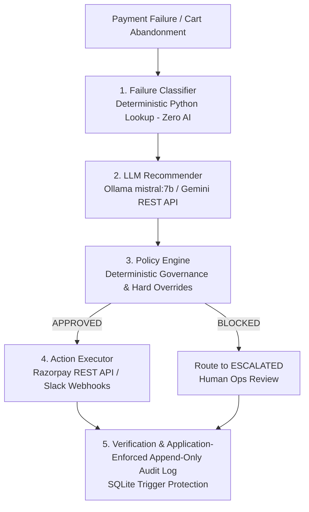

# RecoverAI — AI Revenue Recovery Agent

[](https://github.com/abhijitsvsk/Recoverr-ai-pipeline)
[](https://python.org)
[](https://razorpay.com)
[]()
[]()

**RecoverAI** is an enterprise-grade, policy-governed AI revenue recovery platform built for the **Razorpay Buildathon (Track 03)**. It solves uncaptured revenue loss across two distinct, fully isolated recovery pipelines:

1. **Loop 1: Payment Failure Recovery** — Manages post-attempt payment failures (soft declines, gateway errors, expired cards, repeat failures) via smart retries, Razorpay payment links, and Slack escalation.
2. **Loop 2: Checkout Abandonment Recovery** — Recovers pre-payment drop-offs via automated cart reminders, EV-optimized discount nudges, and profit-margin policy safeguards.

---

## 💡 Key Innovation: "Separation of Powers" Architecture

Most AI recovery experiments give LLMs direct access to financial APIs—exposing merchants to catastrophic risks like infinite retry loops or unauthorized 90% discount nudges.

**RecoverAI introduces a strict 4-tier separation of powers:**



> [!IMPORTANT]
> **Financial Safety Invariant**: The LLM **never** executes API calls or moves money directly. The LLM produces a recommendation and reasoning based on structured context. The **Policy Engine** has absolute veto power, ensuring **zero un-governed API calls**.

---

## 📊 Live Benchmark Metrics Scorecard

The platform includes full 100-record benchmark suites evaluated through the complete state machine:

### 💳 Loop 1: Payment Failure Recovery Metrics (100 Benchmark Records)
- **Uncaptured Revenue at Risk**: **₹650,204.00**
- **Captured Revenue Recovered**: **₹70,127.00**
- **Overall Batch Recovery Rate**: **10.79%** (`[Recovered ÷ At Risk] * 100`)
- **Total Escalated Payments**: **45** (21 policy-blocked + 24 policy-approved)
- **Unresolved Payments (`STOPPED`)**: **6**
- **Still Failed Payments (`RETRY`)**: **7**

| Category | Count | Revenue At Risk (INR) | Revenue Recovered (INR) | Recovery Rate (%) |
| :--- | :---: | :---: | :---: | :---: |
| `TEMPORARY` | 40 | ₹249,128.00 | ₹53,632.00 | 21.53% |
| `PERMANENT` | 25 | ₹157,790.00 | ₹16,495.00 | 10.45% |
| `REPEATED_FAILURE` | 20 | ₹127,292.00 | ₹0.00 | 0.00% |
| `UNKNOWN` | 15 | ₹115,994.00 | ₹0.00 | 0.00% |
| **Total** | **100** | **₹650,204.00** | **₹70,127.00** | **10.79%** |

### 🛒 Loop 2: Checkout Abandonment Recovery Metrics (100 Benchmark Records)
- **Carts at Risk**: **₹859,212.00**
- **Carts Recovered**: **₹55,379.00**
- **Overall Batch Recovery Rate**: **6.45%**
- **Total Escalated Checkouts**: **55** (29 direct-approved + 26 policy-blocked-then-escalated)
- **Unresolved Checkouts (`STOPPED`)**: **0**

| Category | Count | Carts At Risk (INR) | Carts Recovered (INR) | Recovery Rate (%) |
| :--- | :---: | :---: | :---: | :---: |
| `HIGH_VALUE_ABANDON` | 15 | ₹511,000.00 | ₹0.00 | 0.00% |
| `RECENT_ABANDON` | 45 | ₹174,261.00 | ₹55,379.00 | 31.78% |
| `REPEAT_ABANDONER` | 20 | ₹72,971.00 | ₹0.00 | 0.00% |
| `STALE_ABANDON` | 20 | ₹100,980.00 | ₹0.00 | 0.00% |
| **Total** | **100** | **₹859,212.00** | **₹55,379.00** | **6.45%** |

---

## 🛡️ Key System Architecture & Technical Guardrails

### 1. Expected Recovery Value (EV) Optimization
The platform evaluates Expected Recovery Value ($EV = P(\text{success} \mid \text{action}) \times \text{amount}$) before executing interventions. The Policy Engine blocked **₹34,552.40** worth of unsafe or unnecessary discount nudges on high-value carts, preserving merchant profit margins.

### 2. Hard Policy Overrides (₹10,000 Risk Boundary)
Any payment or checkout cart exceeding `HIGH_VALUE_THRESHOLD_INR` (₹10,000 / 1,000,000 paise) under high-risk conditions (`REPEATED_FAILURE`, `UNKNOWN`, `HIGH_VALUE_ABANDON`) forces a mandatory **`STOP`** or **`ESCALATE`**. No LLM recommendation can bypass this override.

### 3. Business Outcome vs. Execution Result Separation
The system tracks technical API success (`execution_result`) separately from financial recovery (`business_outcome`). A retry API returning `HTTP 200 OK` is logged as `simulated`/`order_created`, but `business_outcome` is marked as `recovered` **only after independent payment status verification**.

### 4. Application-Enforced Append-Only Audit Log & Idempotency
- **SQLite Triggers**: Triggers `audit_log_no_update` and `audit_log_no_delete` reject any `UPDATE` or `DELETE` attempt on audit logs with a `sqlite3.IntegrityError`.
- **Idempotency Locks**: All webhooks and action triggers enforce `PRIMARY KEY / UNIQUE` constraints on `event_id` to prevent duplicate recovery actions.

---

## 🌐 Live Integrations

- **Razorpay REST API**: Live integration via [razorpay_client.py](file:///d:/Z_shared/Razarrr/razorpay_client.py) using standard library `urllib.request` against Razorpay's Test Mode API (`/v1/orders` & `/v1/payment_links`).
- **Slack Webhook Notifications**: Real-time escalation alerts posted to Slack channels for high-value failures and repeat failures via [action_executor.py](file:///d:/Z_shared/Razarrr/action_executor.py).
- **Merchant Web Dashboard**: Full Flask dark-mode merchant dashboard in [app.py](file:///d:/Z_shared/Razarrr/app.py) & [templates/index.html](file:///d:/Z_shared/Razarrr/templates/index.html) featuring interactive 5-stage transaction audit history drawers.

---

## 🚀 Quick Start & Demo Instructions

### 1. Prerequisites
- Python 3.13+
- Standard Library dependencies only for core backend (`sqlite3`, `urllib`, `json`, `datetime`)
- `flask` for the Merchant Web Dashboard

### 2. Installation & Setup
```bash
# Clone the repository
git clone https://github.com/abhijitsvsk/Recoverr-ai-pipeline.git
cd Recoverr-ai-pipeline

# Install Flask for dashboard
pip install flask
```

### 3. Launch the Merchant Web Dashboard
```bash
python app.py
```
Open `http://127.0.0.1:5000` in your browser to explore:
- Headline Revenue at Risk and Recovery Metrics
- Dual-loop tab switching (Loop 1 Payment Recovery vs Loop 2 Checkout Recovery)
- Interactive transaction list and chronological audit timeline drawers
- Persistent `⚡ DEMO MODE` indicator and instant `<10ms` scenario reset controls

### 4. Run Live Razorpay Test Harness
```bash
# Loop 1 & 2 Live REST API Test
python run_razorpay_live_test.py

# Loop 3 Live Refund REST API Test
python run_dup_razorpay_live_test.py
```
Executes real HTTP requests against Razorpay Test Mode REST API endpoints, generating live order resources (`order_*`), payment links (`plink_*`), and testing refund endpoints with `X-Refund-Idempotency` headers.  
*Note on Live Scope*: Live order creation and refund header authentication are proven live via API. Full end-to-end refund execution requires authorized payment IDs generated through interactive browser Checkout UI submission, which is documented out of scope for pure server-side API testing (same known structural boundary as Loop 1 retry capture).

### 5. Run Full Benchmark Pipeline Runners
```bash
# Loop 1 Payment Recovery Benchmark
python run_metrics_aggregator.py

# Loop 2 Checkout Abandonment Benchmark
python run_checkout_metrics_aggregator.py
```

---

## 📂 Repository File Structure

```
.
├── AGENTS.md                            # Core system invariants & prompt engineering rules
├── POLICY.md                            # Deterministic policy rules, lookup tables & state machine
├── README.md                            # Comprehensive product documentation & buildathon guide
├── AGENT_LOG.md                         # Detailed development history & milestone log
├── app.py                               # Flask web dashboard server (Read-only display layer)
├── templates/
│   └── index.html                       # Dark-mode dashboard frontend with multi-loop audit timeline UI
│
├── Loop 1: Payment Failure Recovery
│   ├── models.py                        # Loop 1 dataclasses & enums (Category, PaymentStatus, RecoveryAction)
│   ├── db.py                            # Loop 1 SQLite schema & immutable audit log triggers
│   ├── generator.py                     # Synthetic data generator (100 reproducible records)
│   ├── classifier.py                    # Deterministic failure classifier
│   ├── llm_recommender.py               # LLM recommendation engine (Ollama mistral:7b / Gemini)
│   ├── policy_engine.py                 # Deterministic policy engine & hard overrides
│   ├── action_executor.py               # Action executor & Slack webhook integration
│   ├── metrics_aggregator.py            # Batch metrics calculation & conversion simulator
│   └── run_*.py                         # Individual step test & evaluation runners
│
├── Loop 2: Checkout Abandonment Recovery
│   ├── checkout_models.py               # Loop 2 dataclasses & enums (CheckoutCategory, CheckoutStatus)
│   ├── checkout_db.py                   # Loop 2 SQLite schema & append-only audit log triggers
│   ├── checkout_generator.py            # Synthetic checkout data generator (100 records)
│   ├── checkout_classifier.py           # Deterministic checkout abandonment classifier
│   ├── checkout_recommender.py          # Checkout LLM recommendation engine
│   ├── checkout_policy_engine.py        # Checkout policy engine & profit-margin safeguards
│   ├── checkout_action_executor.py      # Checkout action executor
│   ├── checkout_metrics_aggregator.py   # Checkout batch metrics aggregator
│   └── run_checkout_*.py                # Loop 2 step test & evaluation runners
│
└── Infrastructure & Integrations
    ├── razorpay_client.py               # Real Razorpay REST API client (/v1/orders, /v1/payment_links)
    ├── webhook_handler.py               # Idempotent webhook ingestion handler
    ├── timing.py                        # Demo mode timing controls (15s backoff vs 900s prod)
    └── run_demo.py                      # Demo harness & instant snapshot reset utility
```

---

## 🏆 Razorpay Buildathon — Track 03 Submission Checklist

- **Track**: Track 03 (AI Revenue Recovery)
- **Scope**: Payment Failure Recovery (Loop 1) & Checkout Abandonment Recovery (Loop 2)
- **Core Philosophy**: *"Separation of Powers — LLM recommends, Policy Engine governs, Action Executor executes, Audit Log records."*
- **Single Strongest Proof Point**: In the `REPEATED_FAILURE` > ₹10,000 scenario (`network_error` attempt 3, ₹12,500 INR), the LLM recommended `ESCALATE`, but the Policy Engine **BLOCKED** it under Rule 1 (Hard Override), mandating `STOP` due to merchant risk policy rules. (Unlike `UNKNOWN` > ₹10,000 where the LLM already recommended `STOP`, this case proves the Policy Engine actively overriding an LLM recommendation).